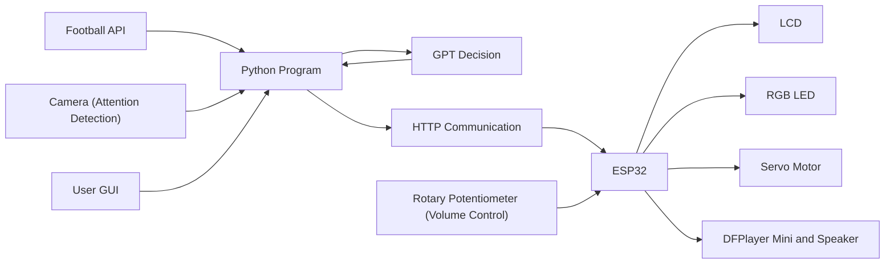

# Football-Assistant-Device
An AI-powered football assistant that tracks live football matches, analyzes user attention with computer vision, evaluates viewing conditions using GPT, and delivers real-time notifications through an ESP32 with an LCD, RGB LED, servo motor, and audio feedback.
We built this project to assist people who needs to watch football stream a midnight in having a more enjoyable and efficient game-watching experience.
https://youtu.be/sUeonObxym8
## Features
- **Live Match Tracking**
  - Retrieves real-time football match data and important match events.

- **Attention Detection**
  - Monitors the viewer's attention using computer vision.

- **AI Decision Making**
  - Combines match status and user attention to generate personalized viewing recommendations.

- **ESP32 Smart Notifications**
  - Delivers notifications through an LCD, RGB LED, servo motor, and speaker.

- **Interactive Match Selection**
  - Allows users to select matches and enter their schedule through a graphical interface.
### Install Python Dependencies

```bash
pip install -r requirements.txt
```
### Install Arduino Libraries

Install the following libraries using the Arduino Library Manager:

- LiquidCrystal_I2C
- ESP32Servo
- DFRobotDFPlayerMini
## Usage

1. Connect the ESP32 device and your computer to the same Wi-Fi network.

2. Run the Python program.

```bash
python main.py
```

3. Select a football match and enter your schedule through the GUI.

4. The system automatically:
   - Retrieves live football match data every **2 minutes**.
   - Evaluates the user's attention status every **5 minutes**.
   - Requests an AI decision every **5 minutes** or immediately after significant match events.

5. AI recommendations are displayed through the LCD, RGB LED, servo motor, and speaker.
## System Architecture

The Football Assistant Device integrates live football data, computer vision, GPT decision-making, and ESP32 hardware to provide intelligent match-viewing assistance.

The Football Assistant Device integrates live football data, computer vision, GPT decision-making, and ESP32 hardware to provide intelligent match-viewing assistance.


## Hardware

The following hardware components are used in the Football Assistant Device.

| Component | Model | 
|-----------|-------|
| ESP32 | ESP32-WROOM-32 | 
| LCD Display | 1602 LCD with I2C | 
| Camera | USB Camera |
| RGB LED | Common Anode RGB LED | 
| Servo Motor | SG90 Micro Servo |
| Audio Module | DFPlayer Mini | 
| Speaker | 8Ω Speaker | 
| Volume Knob | Rotary Potentiometer | 
### Pin Assignment

| Component | Signal | ESP32 Pin | Description |
|-----------|--------|-----------|-------------|
| LCD1602 I2C | SDA | GPIO21 | I2C Data |
| LCD1602 I2C | SCL | GPIO22 | I2C Clock |
| LCD1602 I2C | VCC | 3.3v | |
| LCD1602 I2C | GND| GND | |
| Servo Motor | Signal | GPIO25 | PWM Output |
| Servo Motor | VCC | 5v |  |
| Servo Motor | GND | GND| |
| RGB LED (Common Anode) | Red | GPIO26 | LED Red Channel |
| RGB LED (Common Anode) | Green | GPIO27 | LED Green Channel |
| RGB LED (Common Anode) | Blue | GPIO33 | LED Blue Channel |
| RGB LED (Common Anode) | CA | 5v | |
| DFPlayer Mini | RX | GPIO17 | UART RX |
| DFPlayer Mini | TX | GPIO16 | UART TX |
| DFPlayer Mini | SPK+ | speaker | speaker |
| DFPlayer Mini | SPK- | speaker | speaker|
| DFPlayer Mini | VCC | 5v | |
| DFPlayer Mini | GND | GND | |
| Potentiometer | OUT | GPIO34 | Analog Input (ADC) |
| Potentiometer | VCC |3.3v| |
| Potentiometer | GND | GND | |
## Software

The Football Assistant Device is built using the following software and libraries.

| Software / Library | Purpose |
|--------------------|---------|
| Python | Main application that coordinates the entire system |
| OpenCV | Captures and processes camera images and estimates user attention|
| Tkinter | Provides the graphical user interface for user input |
| OpenAI GPT API | Generates intelligent viewing recommendations |
| Football API | Retrieves real-time football match data and events |
| Requests | Sends HTTP requests to the ESP32 |
| Arduino IDE | Develops and uploads firmware to the ESP32 |
### Software Workflow


