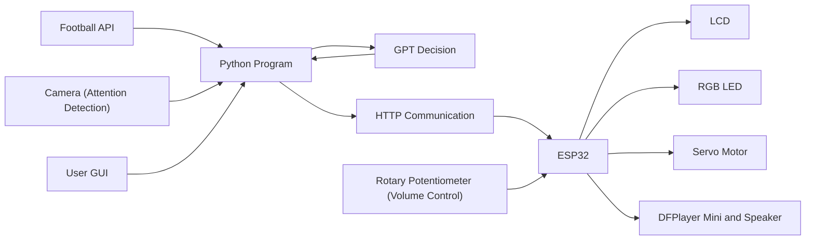
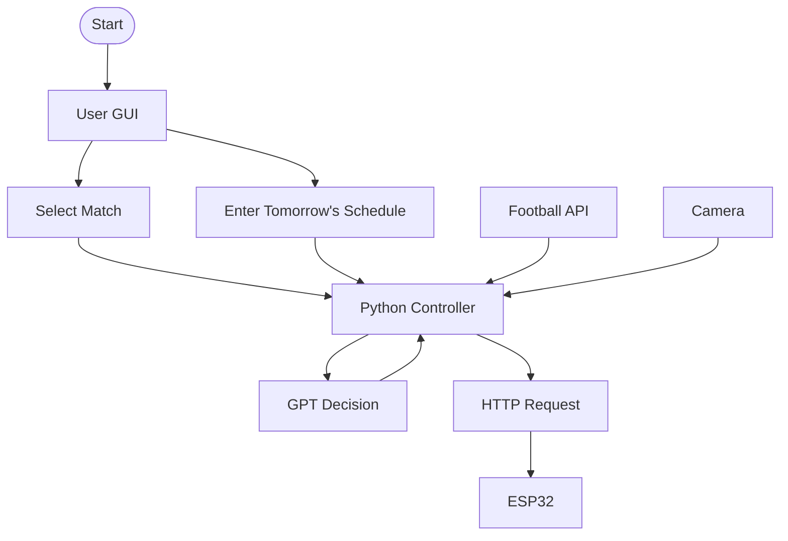

# Football-Assistant-Device
An AI-powered football assistant that tracks live football matches, analyzes user attention with computer vision, evaluates viewing conditions using GPT, and delivers real-time notifications through an ESP32 with an LCD, RGB LED, servo motor, and audio feedback.
We built this project to assist people who needs to watch football stream a midnight in having a more enjoyable and efficient game-watching experience.
https://youtu.be/sUeonObxym8
## Features
- **Live Match Tracking**
  - Retrieves real-time football match data and important match events.

- **Attention Detection**
  - Monitors the viewer's attention using computer vision.

- **AI Decision Making**
  - Combines match status and user attention to generate personalized viewing recommendations.

- **ESP32 Smart Notifications**
  - Delivers notifications through an LCD, RGB LED, servo motor, and speaker.

- **Interactive Match Selection**
  - Allows users to select matches and enter their schedule through a graphical interface.
## System Architecture

The Football Assistant Device integrates live football data, computer vision, GPT decision-making, and ESP32 hardware to provide intelligent match-viewing assistance.
## System Architecture

The Football Assistant Device integrates live football data, computer vision, GPT decision-making, and ESP32 hardware to provide intelligent match-viewing assistance.

## Hardware

The following hardware components are used in the Football Assistant Device.

| Component | Model | 
|-----------|-------|
| ESP32 | ESP32-WROOM-32 | 
| LCD Display | 1602 LCD with I2C | 
| Camera | USB Camera |
| RGB LED | Common Anode RGB LED | 
| Servo Motor | SG90 Micro Servo |
| Audio Module | DFPlayer Mini | 
| Speaker | 8Ω Speaker | 
| Volume Knob | Rotary Potentiometer | 
## Software

The Football Assistant Device is built using the following software and libraries.

| Software / Library | Purpose |
|--------------------|---------|
| Python | Main application that coordinates the entire system |
| OpenCV | Captures and processes camera images and estimates user attention|
| Tkinter | Provides the graphical user interface for user input |
| OpenAI GPT API | Generates intelligent viewing recommendations |
| Football API | Retrieves real-time football match data and events |
| Requests | Sends HTTP requests to the ESP32 |
| Arduino IDE | Develops and uploads firmware to the ESP32 |
### Software Workflow

